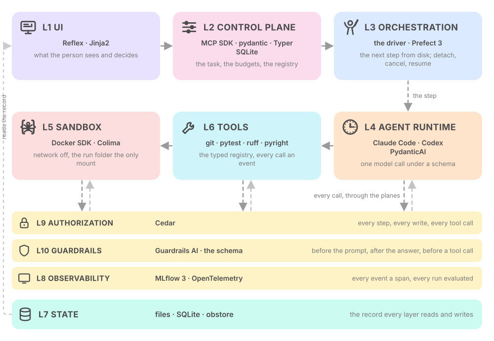
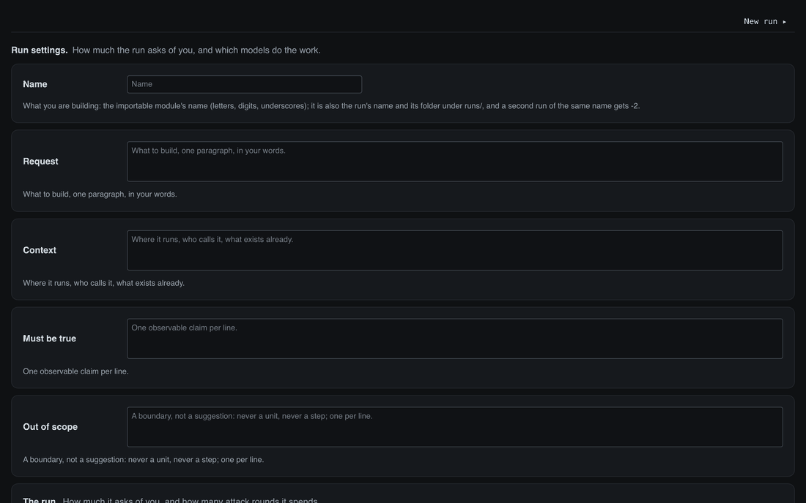
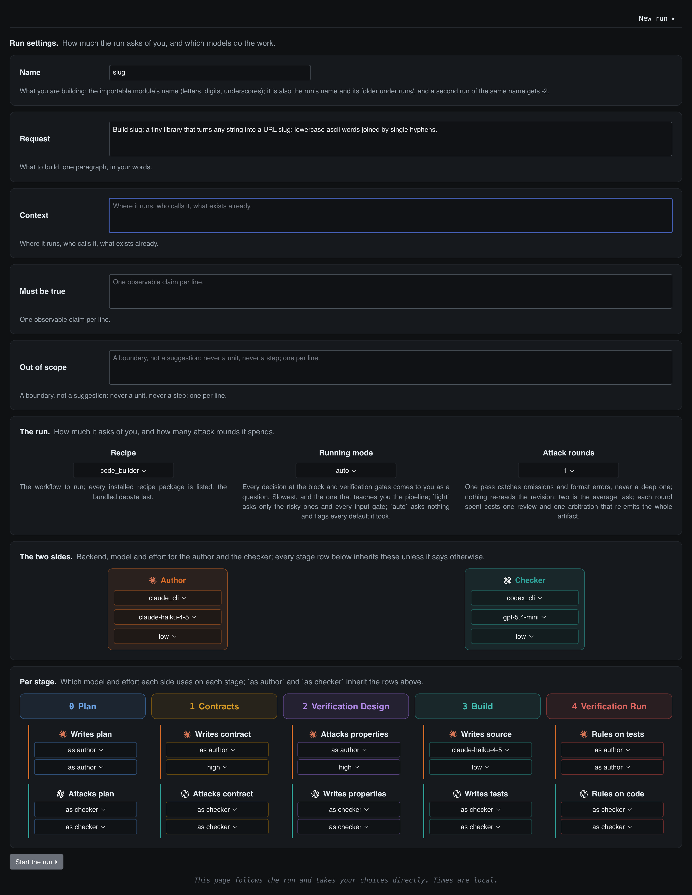
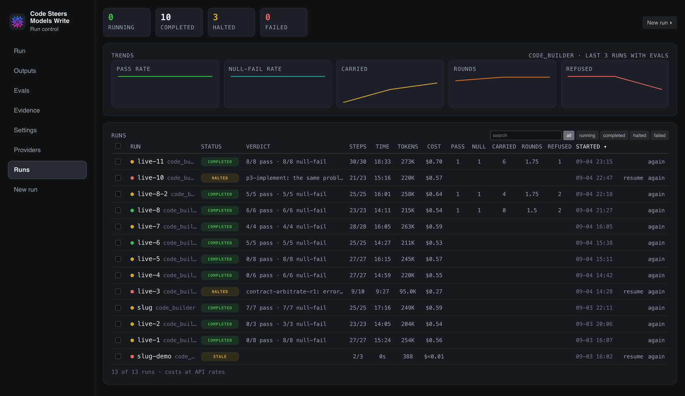
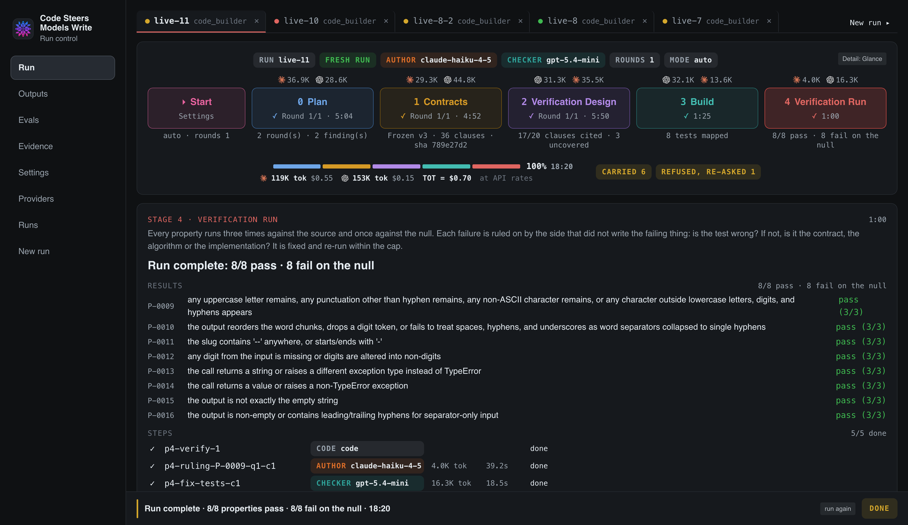
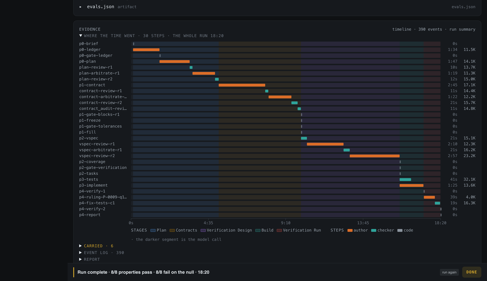

<p align="center"><picture>
<source media="(prefers-color-scheme: dark)" srcset="docs/media/banner-dark.svg">

</picture></p>

<p align="center"><b>Code steers, models write, coder: two model sides of different vendors build a Python module, with code deciding every step.</b><br>A production-grade agentic workflow: ten layers, each behind a seam with one production tool, proven live end to end.<br>A Claude Code plugin with its own MCP server: one command starts a build that runs on the side, sends nothing back into your session, and is watched on its page.</p>


<p align="center">
<a href="https://reflex.dev/"></a>
<a href="https://jinja.palletsprojects.com/"></a>
<a href="https://docs.pydantic.dev/"></a>
<a href="https://modelcontextprotocol.io/"></a>
<a href="https://typer.tiangolo.com/"></a>
<a href="https://www.sqlite.org/"></a>
<a href="https://www.prefect.io/"></a>
<a href="https://docs.anthropic.com/en/docs/claude-code"></a>
<a href="https://github.com/openai/codex"></a>
<a href="https://ai.pydantic.dev/"></a>
<a href="https://docs.docker.com/engine/api/sdk/"></a>
<a href="https://github.com/abiosoft/colima"></a>
<a href="https://git-scm.com/"></a>
<a href="https://docs.pytest.org/"></a>
<a href="https://docs.astral.sh/ruff/"></a>
<a href="https://github.com/microsoft/pyright"></a>
<a href="https://developmentseed.org/obstore/"></a>
<a href="https://mlflow.org/"></a>
<a href="https://opentelemetry.io/docs/specs/semconv/gen-ai/"></a>
<a href="https://www.cedarpolicy.com/"></a>
<a href="https://www.guardrailsai.com/"></a>
<a href="LICENSE"></a>
<a href="https://www.python.org/"></a>
<a href="https://docs.anthropic.com/en/docs/claude-code"></a>
<a href="https://openai.com/codex/"></a>
</p>

<p align="center"><a href="#a-production-grade-agentic-workflow">The layers</a> · <a href="#see-it-run">See it run</a> · <a href="#quick-start">Quick start</a> · <a href="#workflow">Workflow</a> · <a href="#origins">Origins</a> · <a href="#license">License</a></p>

<p align="center">
<a href=".claude-plugin/plugin.json"></a>
<a href="scripts/mcp.sh"></a>
<a href="csmw_coder/workflow.py"></a>
<a href="examples/code_builder/task.json"></a>
<a href="plugin/defaults.json"></a>
</p>

<p align="center"><i>Independent open-source project. Not affiliated with or endorsed by Anthropic or OpenAI.<br>Claude and Claude Code are trademarks of Anthropic; Codex and GPT are trademarks of OpenAI. Prefect, MLflow, Reflex, PydanticAI, pydantic, Guardrails AI, Cedar, Docker, Colima, obstore, Typer, Jinja2, SQLite, OpenTelemetry, the Model Context Protocol, ruff, pyright and pytest belong to their owners.</i></p>

## A production-grade agentic workflow

<p><i>Execution layers and governance planes</i></p>

The workflow runs on a runtime of seven execution layers and three cross-cutting planes, each
behind a seam with one production-grade package chosen for it: free, self-hosted, a Python SDK,
the same tool the platforms ship. The ten came out of reading what Anthropic, OpenAI, Google,
Microsoft, AWS, Palantir and IBM publish about their agent platforms, and the papers and
standards behind them; the second table says what each layer rests on, with the sources.

<p align="center"><picture>
<source media="(prefers-color-scheme: dark)" srcset="docs/media/layers-dark.svg">

</picture></p>


    

| group | layer | what it owns | behind the seam |
|---|---|---|---|
|  | **L1 UI** | a home of every run, the run page, the start page | <a href="https://reflex.dev/"></a> <a href="https://jinja.palletsprojects.com/"></a> |
|  | **L2 control plane** | the task, the budgets, the run registry, the MCP server this plugin declares | <a href="https://docs.pydantic.dev/"></a> <a href="https://modelcontextprotocol.io/"></a> <a href="https://typer.tiangolo.com/"></a> <a href="https://www.sqlite.org/"></a> |
|  | **L3 orchestration** | the sequence: the driver derives the next step from disk; the runner detaches, cancels, pauses, resumes, runs the tests and the source side by side | <a href="https://www.prefect.io/"></a> |
|  | **L4 agent runtime** | one model call under a schema | <a href="https://docs.anthropic.com/en/docs/claude-code"></a> <a href="https://github.com/openai/codex"></a> <a href="https://ai.pydantic.dev/"></a> |
|  | **L5 sandbox** | where every check runs, bounded: network off, the run folder the only mount | <a href="https://docs.docker.com/engine/api/sdk/"></a> <a href="https://github.com/abiosoft/colima"></a> |
|  | **L6 tools** | the typed registry of git, pytest, ruff and pyright, every call an event | <a href="https://git-scm.com/"></a> <a href="https://docs.pytest.org/"></a> <a href="https://docs.astral.sh/ruff/"></a> <a href="https://github.com/microsoft/pyright"></a> |
|  | **L7 state** | the record: files per run, versioned artifacts, the index across runs | <a href="https://www.sqlite.org/"></a> <a href="https://developmentseed.org/obstore/"></a> |
|  | **L8 observability** | traces, tokens, the five evaluations, trends across runs | <a href="https://mlflow.org/"></a> <a href="https://opentelemetry.io/docs/specs/semconv/gen-ai/"></a> |
|  | **L9 authorization** | may this side author, judge, write or call this | <a href="https://www.cedarpolicy.com/"></a> |
|  | **L10 guardrails** | before the prompt, after the answer, before a tool call | <a href="https://www.guardrailsai.com/"></a> <a href="https://docs.pydantic.dev/"></a> |

The layering is the shape the production platforms have converged on. AWS Bedrock AgentCore
names thirteen services [1], Google Vertex Agent Engine eleven [2], Palantir AIP twelve [3],
Microsoft Foundry seven plus four [4], IBM watsonx Orchestrate about eleven [5]; strip each to
what a single-machine runtime needs and the same ten remain: a core of interface, control,
orchestration, model runtime, execution, tools and state, with authorization, guardrails and
observability cut across all of them. The academic reference architectures draw the same
picture [6, 7, 8], and the separation of the planes from the model is the reference-monitor
principle [9, 10] as the agent-security work applies it [11, 12, 13]. Per layer:

| layer | grounded in |
|---|---|
| L1 UI | agents must have well-defined human controllers [14]; the human-in-the-loop patterns of the vendor guides [15, 16, 17] |
| L2 control plane | AgentCore's Gateway, Registry and Policy [1]; Vertex's Agent Gateway and Sessions [2]; the budget as a first-class control [7]; the control plane of the agent OS [18] |
| L3 orchestration | Microsoft's orchestration patterns and durable task ledger [17]; Prefect's flow-run model as the runner; the decision procedure of a cognitive architecture, code sequencing and the model never [19] |
| L4 agent runtime | AgentCore Runtime [1], Vertex Agent Runtime [2], Foundry Agent Runtime [4]; the model's action space as one structured answer [19]; the vendor CLIs' own runtimes [20, 21] |
| L5 sandbox | AgentCore Code Interpreter and Vertex Code Execution as separate services [1, 2]; the sandboxing designs of Claude Code and Codex [20, 21]; security function isolation [22]; the "lethal trifecta" [23]; capability-based isolation [11] |
| L6 tools | AgentCore Gateway's tool contract and Vertex's tool services [1, 2]; the Model Context Protocol [24]; privilege control per tool with a closed declared list [12] |
| L7 state | Google ADK's split of session state, memory and versioned artifacts [25]; AgentCore Memory's short-term events and long-term store [1]; memory as its own tier [26, 27, 28]; provenance of every artifact [29, 30] |
| L8 observability | AgentCore Observability and Evaluations [1]; Vertex Evaluation Service [2]; Databricks Mosaic AI on MLflow tracing and agent evaluation [31]; OpenAI's trace and span model [16]; provenance graphs of agent runs [29, 30]; repudiation as a named agent threat [32] |
| L9 authorization | AgentCore Identity and Policy, Cedar at the gateway [1]; Vertex Agent Identity [2]; Foundry's identity and RBAC [4]; the reference monitor [9]; attribute-based access control and the policy-decision / policy-enforcement split [33, 34]; least privilege for agent powers [14, 10]; context-derived policies for agents [13] |
| L10 guardrails | OpenAI's input, output and tool guardrails [16]; Salesforce's Einstein Trust Layer [35]; NVIDIA's rail types [36]; prompt injection as the top LLM threat [37]; defence by design [11]; the injection benchmark rails are measured against [38] |

<details>
<summary><b>References</b></summary>

Industry platforms and guides

1. AWS, Amazon Bedrock AgentCore developer guide: Harness, Runtime, Memory, Gateway, Identity, Code Interpreter, Browser, Observability, Payments, Evaluations, Optimization, Policy, Registry. https://docs.aws.amazon.com/bedrock-agentcore/latest/devguide/what-is-bedrock-agentcore.html
2. Google Cloud, Vertex AI Agent Engine overview: Agent Runtime, Sessions, Memory Bank, Code Execution, Evaluation Service, Agent Identity, Agent Gateway, Observability and others. https://docs.cloud.google.com/vertex-ai/generative-ai/docs/agent-engine/overview
3. Palantir, AIP architecture. https://www.palantir.com/docs/foundry/architecture-center/aip-architecture
4. Microsoft, Azure AI Foundry Agent Service overview. https://learn.microsoft.com/en-us/azure/ai-foundry/agents/overview
5. IBM, watsonx Orchestrate overview. https://www.ibm.com/docs/en/watsonx/watson-orchestrate/base?topic=overview
6. A reference architecture for LLM-based agentic systems: Interface, Core, Control, Memory, Tooling, with Governance and Observability cross-cutting. arXiv 2026. https://arxiv.org/abs/2602.10479
7. Liu et al., "Agent Design Pattern Catalogue" (CSIRO). arXiv 2024. https://arxiv.org/abs/2405.10467
8. Lu et al., "A Reference Architecture for Designing Foundation Model based Agents" (CSIRO). arXiv 2023. https://arxiv.org/abs/2311.13148
9. Anderson, "Computer Security Technology Planning Study" (the reference monitor). 1972. https://csrc.nist.gov/files/pubs/conference/1998/10/08/proceedings-of-the-21st-nissc-1998/final/docs/early-cs-papers/ande72a.pdf
10. Saltzer and Schroeder, "The Protection of Information in Computer Systems". 1975. https://www.cs.virginia.edu/~evans/cs551/saltzer/
11. Debenedetti et al., "CaMeL: Defeating Prompt Injections by Design" (Google DeepMind, ETH). arXiv 2025. https://arxiv.org/abs/2503.18813
12. Shi et al., "Progent: Programmable Privilege Control for LLM Agents". arXiv 2025. https://arxiv.org/abs/2504.11703
13. Tsai and Bagdasarian, "Conseca: Context-derived Security Policies for LLM Agents". arXiv 2025. https://arxiv.org/abs/2501.17070
14. Google, "An Introduction to Google's Approach for Secure AI Agents". 2025. https://research.google/pubs/an-introduction-to-googles-approach-for-secure-ai-agents/
15. Anthropic, "Building Effective Agents". 2024. https://www.anthropic.com/research/building-effective-agents
16. OpenAI, "A Practical Guide to Building Agents" and the Agents SDK guardrails and tracing documentation. 2025. https://cdn.openai.com/business-guides-and-resources/a-practical-guide-to-building-agents.pdf
17. Microsoft, Azure Architecture Center, "AI agent orchestration patterns". 2026. https://learn.microsoft.com/en-us/azure/architecture/ai-ml/guide/ai-agent-design-patterns
18. Mei et al., "AIOS: LLM Agent Operating System". arXiv 2024, COLM 2025. https://arxiv.org/abs/2403.16971
19. Sumers, Yao, Narasimhan and Griffiths, "Cognitive Architectures for Language Agents" (CoALA). TMLR 2024. https://arxiv.org/abs/2309.02427
20. Anthropic, Claude Code security and sandboxing. https://code.claude.com/docs/en/sandboxing
21. OpenAI, Codex agent approvals and security. https://learn.chatgpt.com/codex/agent-approvals-security
22. NIST SP 800-53 rev. 5, control SC-3, security function isolation. https://csrc.nist.gov/pubs/sp/800/53/r5/upd1/final
23. Willison, "The Lethal Trifecta for AI Agents". 2025. https://simonwillison.net/2025/Jun/16/the-lethal-trifecta/
24. Model Context Protocol, specification, architecture. https://modelcontextprotocol.io/specification/2025-06-18/architecture
25. Google, Agent Development Kit: sessions, state, memory and artifacts. https://google.github.io/adk-docs/agents/
26. Packer et al., "MemGPT: Towards LLMs as Operating Systems". arXiv 2023. https://arxiv.org/abs/2310.08560
27. Park et al., "Generative Agents: Interactive Simulacra of Human Behavior". UIST 2023. https://arxiv.org/abs/2304.03442
28. Zhang et al., "A Survey on the Memory Mechanism of Large Language Model based Agents". arXiv 2024. https://arxiv.org/abs/2404.13501
29. Souza et al., "PROV-AGENT". IEEE e-Science 2025. https://arxiv.org/abs/2508.02866
30. Wu, Castelo, Liu, Silva and Freire, "AgentTrails". VLDB 2026 DASHSys workshop. https://arxiv.org/abs/2607.18816
31. Databricks, Mosaic AI agent framework: MLflow tracing and agent evaluation. https://docs.databricks.com/aws/en/generative-ai/agent-framework/build-genai-apps
32. OWASP, "Agentic AI Threats and Mitigations" (T8, repudiation and untraceability). 2025. https://genai.owasp.org/resource/agentic-ai-threats-and-mitigations/
33. NIST SP 800-162, "Guide to Attribute Based Access Control". https://nvlpubs.nist.gov/nistpubs/specialpublications/NIST.sp.800-162.pdf
34. OASIS, XACML 3.0 core specification (PDP, PEP, PIP, PAP). https://docs.oasis-open.org/xacml/3.0/xacml-3.0-core-spec-os-en.html
35. Salesforce, the Einstein Trust Layer. https://trailhead.salesforce.com/content/learn/modules/the-einstein-trust-layer/meet-the-einstein-trust-layer
36. NVIDIA, NeMo Guardrails: input, dialog, retrieval, execution and output rails. https://docs.nvidia.com/nemo/guardrails/
37. OWASP, "Top 10 for LLM Applications" 2025 (LLM01 prompt injection, LLM06 excessive agency). https://genai.owasp.org/llm-top-10/
38. Debenedetti et al., "AgentDojo". NeurIPS 2024 Datasets and Benchmarks. https://arxiv.org/abs/2406.13352

</details>

## See it run

One production run on claude-haiku-4-5 and gpt-5.4-mini in auto mode, from the home that lists
every run, into the finished run, down to where the time went: every step under a schema, every
check in a container, every event traced.

<p align="center"></p>

<p align="center">


</p>
<p align="center">


</p>

## Quick start

Install the plugin once, then start a production-grade build from any Claude Code session:

```bash
claude plugin install github:msoliman6/csmw_coder
```

```text
/csmw-coder:build      turns what the conversation established into a task and starts the run
/csmw-coder:status     one line per run, newest first
/csmw-coder:dashboard  the page's address, starting it if needed
```

The plugin declares an MCP server; `/csmw-coder:build` hands the task to it, and the run starts
detached under the production runner. The answer back into your session is one line, its name,
the page's address and its folder, and nothing else ever comes back: the run does its work on
the side, the page is where it is watched, and the report lands in the folder. Claude Code writes, OpenAI
Codex checks, both on your own logins, low effort, auto mode, one round; change the defaults in
`plugin/defaults.json` or say what you want before `/csmw-coder:build`. The plugin's MCP server
answers every verb (`workflow_run`, `workflow_status`, `workflow_cancel`, `workflow_pause`,
`workflow_resume`, `workflow_run_again`, `run_list`, `run_get`, `run_logs`, `run_artifacts`,
`run_forget`) to any MCP host. Runs live under `~/.csmw/runs`.

**Cost.** The page prices a run's tokens on read from a vendored copy of LiteLLM's model price map
(420 models, the file and not the package). A model the map does not know shows `$?`. To override
a rate, put it in `prices.json` as US dollars per million tokens, input first, output second:
`{"my-negotiated-model": [0.25, 2.0]}`. Cached input is billed at the map's cached rate.
The figure is the API price of the tokens; a side run on `claude -p` or `codex exec` under a
subscription login is not billed per token, and the page marks such an estimate "at API rates".


## Workflow

**Optimized for correctness.** The workflow is built so that a model can only do the one thing
each step asks of it, and code decides everything else:

- A model reads markdown, everywhere. Code renders every input it sees and inlines it; a model
  never opens a file or reads raw JSON.
- A model fills a JSON schema, everywhere, under constrained decoding at generation and
  pydantic again on receipt. There is no free text to parse.
- A model has no read, write, tool, shell or network access unless the task needs it, and then
  only inside its own output folder. It cannot wander; it can only answer.
- A refused answer is never recorded. It is re-asked with the exact problems, bounded, and the
  loop stops when the same problems come back.
- No side grades its own work. The checker is a different vendor, on a frozen copy; every
  element carries a code-assigned id, so coverage is a set difference, not a judgment.
- Every loop is bounded and carries its trajectory; what does not converge is carried into the
  report, never dropped. Tokens are the measure; dollars are a lookup.

What each stage does, who writes and who attacks, where code freezes, merges and runs, on the production-grade runtime above:

<p align="center"><picture>
<source media="(prefers-color-scheme: dark)" srcset="docs/media/workflow-dark.svg">

</picture></p>

## Origins

**The name.** csmw is *code steers, models write*: code decides every step, renders every input,
checks every answer and writes every file; a model only ever answers. The page says the same
thing in its top-left corner.


- [claudex-loop](https://github.com/chaseai-yt/claudex-loop): Claude Code paired with OpenAI Codex as an adversarial reviewer inside a Claude Code plugin, the pairing this repo is built around.

## License

MIT.
