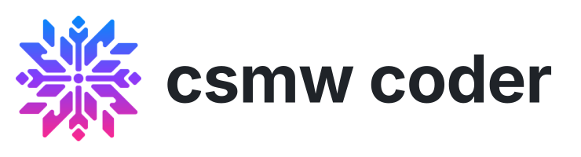
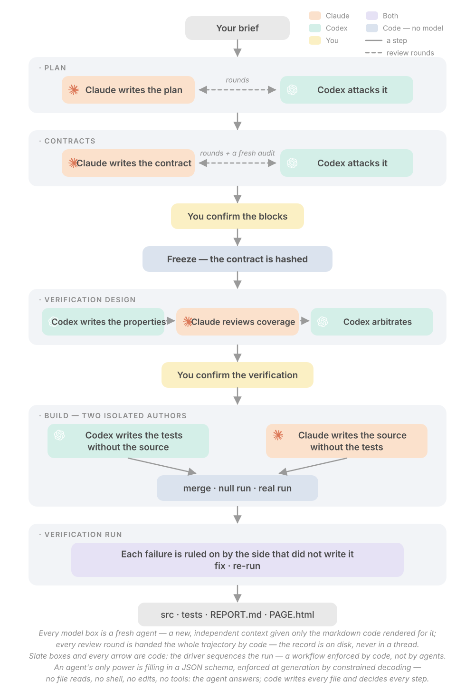
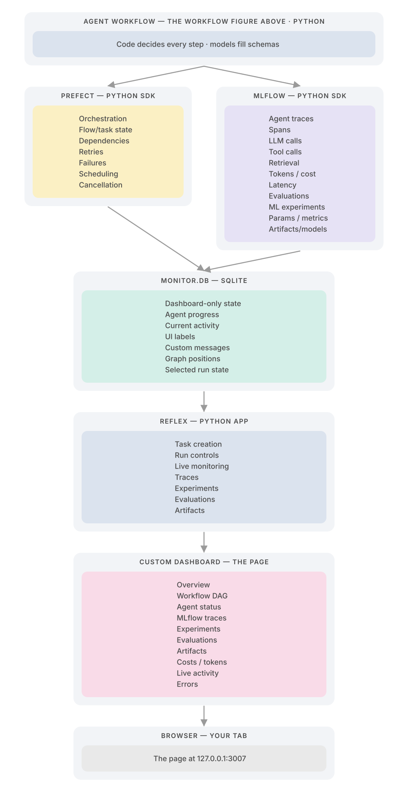

<p align="center"><picture>
<source media="(prefers-color-scheme: dark)" srcset="docs/media/banner-dark.svg">

</picture></p>

<p align="center"><b>The code-builder workflow: two model sides of different vendors build a Python module, with code deciding every step.</b></p>

<p align="center">
<a href="LICENSE"></a>
<a href="https://www.python.org/"></a>
<a href="https://docs.pydantic.dev/"></a>
<a href="https://www.prefect.io/"></a>
<a href="https://mlflow.org/"></a>
<a href="https://reflex.dev/"></a>
</p>
<p align="center">
<a href="https://docs.astral.sh/ruff/"></a>
<a href="https://github.com/microsoft/pyright"></a>
<a href="https://docs.pytest.org/"></a>
<a href="https://www.sqlite.org/"></a>
<a href="https://docs.litellm.ai/"></a>
</p>
<p align="center">
<a href="https://docs.anthropic.com/en/docs/claude-code"></a>
<a href="https://openai.com/codex/"></a>
<a href="https://github.com/anthropics/anthropic-sdk-python"></a>
<a href="https://github.com/anthropics/claude-agent-sdk-python"></a>
<a href="https://docs.anthropic.com/en/docs/claude-code"></a>
<a href="https://github.com/openai/codex"></a>
</p>

<p align="center"><a href="#workflow">Workflow</a> · <a href="#harness">Harness</a> · <a href="#how-the-models-are-held">How the models are held</a> · <a href="#quick-start">Quick start</a> · <a href="#license">License</a></p>

<p align="center">
<a href="examples/code_builder/task.json"></a>
<a href="csmw_coder/workflow.py"></a>
</p>

<p align="center"><i>Independent open-source project. Not affiliated with or endorsed by Anthropic or OpenAI.<br>Claude and Claude Code are trademarks of Anthropic; Codex and GPT are trademarks of OpenAI. Prefect, MLflow, Reflex, ruff, pyright and pytest belong to their owners.</i></p>

The **code-builder** workflow: two model sides
of different vendors build a Python module through a plan, a frozen contract, a verification
design, an isolated build and a verification run, with code deciding every step.

## Workflow

The block diagram of this workflow, generated from its definition (`just figure`): what each stage
does, who writes and who attacks, where code freezes, merges and runs.

<p align="center"><picture>
<source media="(prefers-color-scheme: dark)" srcset="docs/media/workflow-dark.svg">

</picture></p>

## Harness

The harness operates on top of the workflow: the workflow figure above is the top box of this
one. The agent workflow is Python; it feeds Prefect and MLflow through their SDKs; both feed
`monitor.db`; Reflex is the human control plane; the custom dashboard is what you look at.

<p align="center"><picture>
<source media="(prefers-color-scheme: dark)" srcset="docs/media/harness-dark.svg">

</picture></p>

<details>
<summary><b>Clean responsibility split</b></summary>

| system | owns |
|---|---|
| **Prefect** | workflow execution · task dependencies · retries · scheduling · cancellation · run/task state |
| **MLflow** | agent / LLM traces · spans · tool calls · retrieval traces · token / cost / latency · workflow / agent evaluation · scientific / ML experiments · parameters / metrics · artifacts / models |
| **monitor.db** | dashboard-only state · live human-readable progress · current activity · UI metadata · graph layout / positions |
| **Reflex** | human control plane · create tasks · launch / cancel runs · live dashboard · inspect traces · inspect experiments · inspect evaluations |

</details>

<details>
<summary><b>Shared workflow id</b></summary>

Every subsystem receives the same application-level id, and the dashboard joins on it:

```text
workflow_run_id = "run_123"
   |
   +-- Prefect -----> What is executing?
   +-- MLflow ------> What did the agents do? How did the experiment perform?
   +-- monitor.db --> What UI-specific state should be displayed?
```

</details>

## How the models are held

The rules below are the ones this workflow leans on, taken from the harness's fourteen.

- **Every model answer is constrained decoding against one schema.** Each call carries one pydantic
  schema; the backend enforces it at generation (Anthropic and Codex grammars, the Agent SDK's tool
  boundary) and pydantic validates it again. A model never writes prose into the run, only a JSON
  object of the declared shape.
- **Agents read markdown that code rendered from JSON.** No model is handed a file path, raw JSON or
  another model's prose; code renders every input and inlines it into the prompt.
- **Tools, files and shell are granted by need, never by default.** A step that needs them declares
  it, and then only inside the folder the agent writes its output to; every other step is issued with
  no tools at all, stated in the prompt and enforced by the harness.
- **No agent grades its own work.** The checker attacks a frozen copy, from a different vendor.
- **Every element has a code-assigned id, never renumbered.** Findings cite ids, so coverage is a set
  difference, not a judgment.
- **Nothing is recorded from a refused answer.** A refusal is re-asked with the exact problems and the
  refused answer, at most six times, stopping when the problem set repeats.
- **Every loop is bounded by code and carries its full trajectory.** Convergence is computed; the
  unresolved is carried into the report, never hidden.
- **Tokens are the honest measure.** Dollars are a lookup on read, blank until the price is known.

<details>
<summary><b>A schema, as the model receives it</b> — the review round's answer</summary>

Generated from the pydantic class by `wire_schema()`: every field required, no extra keys, ranges
kept in validators rather than the grammar.

```json
{
  "$defs": {
    "Finding": {
      "additionalProperties": false,
      "properties": {
        "severity": {
          "$ref": "#/$defs/Severity"
        },
        "cites": {
          "description": "the ids this finding is about (they must exist)",
          "items": {
            "type": "string"
          },
          "type": "array"
        },
        "kind": {
          "description": "gap: the input itself is silent on this; routes to the human",
          "enum": [
            "finding",
            "gap"
          ],
          "type": "string"
        },
        "klass": {
          "$ref": "#/$defs/Klass"
        },
        "argument": {
          "description": "why, engaging the cited text; a reader can check it",
          "type": "string"
        }
      },
      "required": [
        "severity",
        "cites",
        "kind",
        "klass",
        "argument"
      ],
      "type": "object"
    },
    "Klass": {
      "description": "The reconcile class (after addyosmani's agent-skills): what kind of thing a finding is.\nPrecedence when a finding could be two: contract_misread > actionable > tradeoff > noise.",
      "enum": [
        "contract_misread",
        "actionable",
        "tradeoff",
        "noise"
      ],
      "type": "string"
    },
    "Severity": {
      "enum": [
        "blocking",
        "major",
        "minor"
      ],
      "type": "string"
    }
  },
  "additionalProperties": false,
  "description": "A review round's answer. Empty `findings` with APPROVED is allowed (rule 9: the empty\nset is a valid answer); zero findings after several rounds is weak evidence, and the\nreviewer prompt says so.",
  "properties": {
    "findings": {
      "description": "empty means you found nothing",
      "items": {
        "$ref": "#/$defs/Finding"
      },
      "type": "array"
    },
    "verdict": {
      "description": "REVISE iff at least one finding is filed",
      "enum": [
        "APPROVED",
        "REVISE"
      ],
      "type": "string"
    }
  },
  "required": [
    "findings",
    "verdict"
  ],
  "type": "object",
  "title": "Findings"
}
```

</details>

<details>
<summary><b>An answer that passes</b></summary>

```json
{
  "findings": [
    {
      "severity": "major",
      "cites": [
        "C-0007"
      ],
      "kind": "finding",
      "klass": "actionable",
      "argument": "C-0007 keeps alphanumeric content in order but says nothing about an input that is only separators; two implementers resolve it two ways."
    }
  ],
  "verdict": "REVISE"
}
```

Code then checks that every cited id exists in the text the reviewer was shown, assigns the finding
its `F-` id, and only then writes the file.

</details>

## Quick start

```bash
just install          # a venv with the harness and this package
just doctor           # the backends, the CLIs, the keys
just walk             # every branch offline with fake models, zero tokens
just run              # the example task live (claude -p as author, codex exec as checker)
just dash             # the page at http://127.0.0.1:3007
```

The example task (`examples/code_builder/task.json`) builds a slug library. Runs live under
`runs/` and are never committed.

## Origins

- [claudex-loop](https://github.com/chaseai-yt/claudex-loop): Claude Code paired with OpenAI Codex as an adversarial reviewer inside a Claude Code plugin, the pairing this repo is built around.

## License

MIT.
